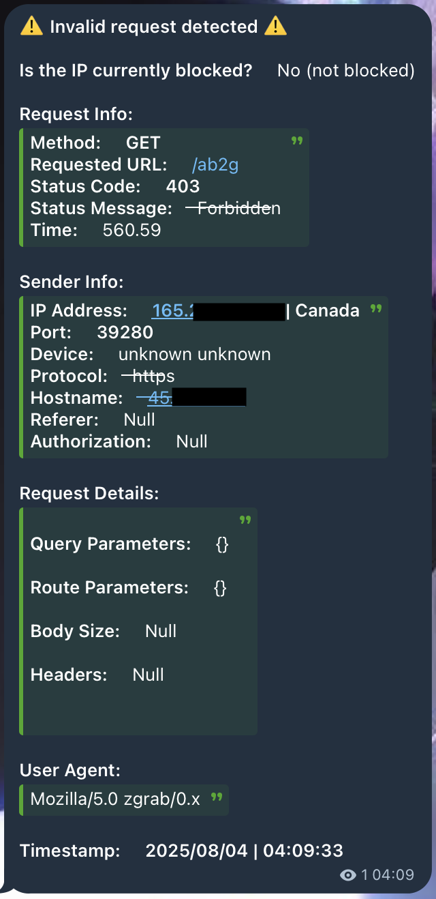
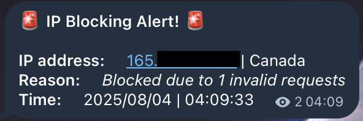

# Telegram Security Monitor Bot

A simple Telegram bot designed to monitor and dispatch security alerts from a backend service to a dedicated Telegram channel via RabbitMQ. This bot acts as a real-time notification system for critical events like invalid requests and IP blocking alerts.

## ✨ Features

- **Real-time Notifications:** Instantly sends messages from a RabbitMQ queue to a Telegram channel.
- **Structured Alerts:** Supports two distinct types of messages for different alert severities or categories.
- **Modular Configuration:** Easy to configure using environment variables (`.env`) for seamless deployment.

## 🚀 Technologies Used

- **Runtime:** Node.js
- **Framework:** Telegraf (Telegram Bot Framework)
- **Messaging Queue:** amqplib (for RabbitMQ integration)
- **Dependency Management:** Yarn
- **Development:** TypeScript, ts-node-dev
- **Utilities:** pino, winston, dayjs, axios

## 🚦 Prerequisites

To run this project, you need to have the following installed on your system:

- Node.js (LTS version recommended)
- Yarn or npm
- A running RabbitMQ server

## ⚙️ Getting Started

Follow these steps to set up and run the bot on your local machine:

**1. Clone the repository:**

```
git clone https://github.com/your-username/Telegram-Security-Monitor-Bot.git
cd Telegram-Security-Monitor-Bot
```

**2. Configure Environment Variables:**

Create a `.env` file in the root directory of the project and fill in the required information.

```
PORT = 8274
BOT_TOKEN = your-bot-token
RABBITMQ_URL = your-amqp-url
ALERT_CHAT_ID = your-channel-id
```

> **Note:** The `BOT_TOKEN` can be obtained by creating a new bot on Telegram via BotFather. The `ALERT_CHAT_ID` is the ID of the channel where you want the alerts to be sent.

**3. Install Dependencies:**

Install the necessary packages using Yarn:

```
yarn install
```

**4. Build the Project:**

Compile the TypeScript code to JavaScript:

```
yarn build
```

**5. Run the Bot:**

Start the bot in production mode:

```
yarn start
```

## 🖼️ Message Samples

The bot can send two types of messages. Below are examples of how the alerts will appear in your Telegram channel.

**Message Type 1:**


**Message Type 2:**

